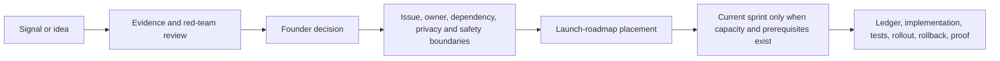

# Strategy Research

These files contain evidence-ranked opportunity research. They do **not** change implementation status, authorize roadmap work, or replace `implementation-ledger.json`, `SPRINT.md`, `docs/LAUNCH_ROADMAP.md`, tests, deployed configuration, or founder approval.

## Current research

- [`../industry-signals/mobile-dev-under-the-radar-2026.md`](../industry-signals/mobile-dev-under-the-radar-2026.md) — canonical ten-trend mobile-development brief, product opportunities, evidence strength, and OODA priorities
- [`VOICE_RLS_VISUAL_INTAKE_2026-07-17.md`](VOICE_RLS_VISUAL_INTAKE_2026-07-17.md) — repository-truth reconciliation of the uploaded voice architecture, SQL/RLS templates, engineering audit, and visual concept boards, with explicit adopt / reframe / reject decisions

## Promotion path

A signal becomes product work only after it is reconciled with:

- current repository and production truth;
- teen privacy, consent, safety, and parent boundaries;
- launch-critical dependencies and controlled-alpha scope;
- one numbered owner issue;
- measurable acceptance criteria;
- implementation-ledger status;
- rollout, rollback, and the correct runtime witness;
- explicit founder approval.

Research may recommend a future lane without making it a launch dependency. L4, L5, beauty-tech concepts, new AI infrastructure, and monetization experiments must not silently enter the active sprint because a trend appears promising.

See:

- `docs/LAUNCH_ROADMAP.md` for phase and scope placement;
- `SPRINT.md` for work active now;
- `docs/DOCUMENTATION_MAP.md` for authority rules;
- `implementation-ledger.json` for machine-checked implementation state.
