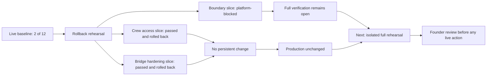

# Controlled-Alpha Validation Map

## Status board

| Area | Status |
|---|---|
| Live catalog | 2 of 12, expected before migration |
| Boundary slice | Platform-blocked before execution |
| Crew access slice | Passed inside rollback |
| Bridge hardening slice | Passed inside rollback |
| Combined rehearsal | Not executed |
| Persistent production changes | Zero |
| PR #495 | Draft and mergeable |

## Decision line

Safe preparation and evidence work may continue. Permanent database changes, merge, deployment, accounts, builds, and distribution remain held until a complete isolated rehearsal passes and the founder gives the separate approval.
